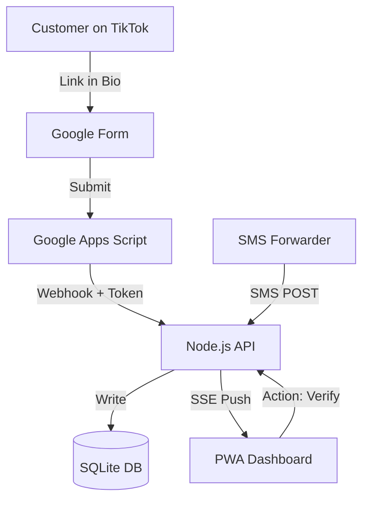

# LiveSoko: Architecture & Data Flow 🔄

LiveSoko is designed for **low-latency data movement**. This document outlines how a customer purchase on TikTok Live becomes a verified order on your dashboard.

## 1. The Intake Loop (Customer -> Form)
1. **TikTok Live**: Customer decides to buy an item.
2. **Google Form**: Customer clicks the link in your bio and fills out their details (TikTok username, Phone, Location).
3. **Apps Script**: On form submission, a Google Apps Script triggers. It formats the data and sends a **POST Request** to the LiveSoko API with your unique `webhook_token`.

## 2. The Verification Loop (Backend -> Dash)
1. **API Arrival**: The backend receives the order. It validates the token and the inputs.
2. **Database Write**: The order is saved to `livesoko.db` with a `PENDING` status.
3. **Real-time Broadcast**: The `SSE Manager` sends a message to all connected clients for that specific `shop_id`.
4. **Instant Notification**: Your LiveSoko PWA vibrates and shows a red "New Order" indicator on the dashboard.

## 3. The Fulfillment Loop (Seller -> Rider)
1. **MPESA Logic**: LiveSoko monitors incoming SMS (via SMS Forwarder) or manual entry.
2. **Status Shift**: When you mark an order as "Verified" or "Fulfilled":
   - The status is updated in SQLite.
   - The UI updates instantly via SSE.
3. **Logistics**: The order is moved to the "Verified" tab, ready for rider dispatch.

## Architecture Diagram (Mermaid)

