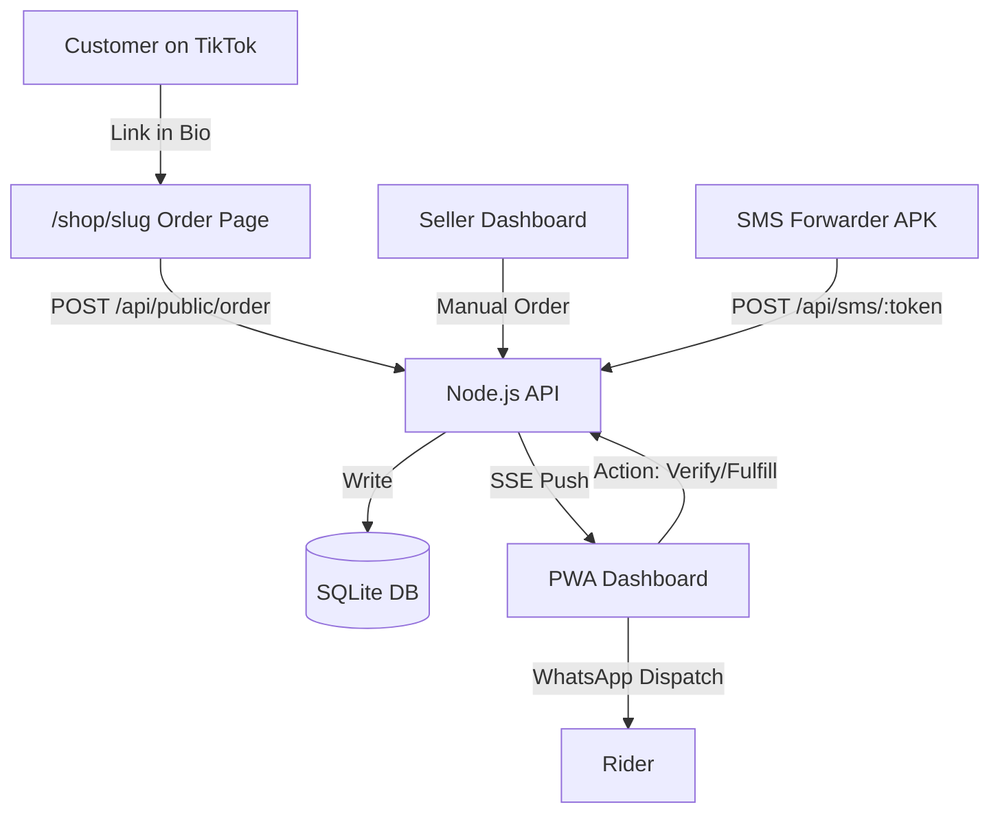

# LiveSoko: Architecture & Data Flow 🔄

LiveSoko is designed for **low-latency data movement**. This document outlines how a customer purchase on TikTok Live becomes a verified order on your dashboard.

## 1. The Intake Loop (Customer → Order)

There are two ways orders enter the system:

### A. Public Order Page (Primary)
1. **TikTok Live**: Customer decides to buy an item.
2. **Shop Link**: Customer taps the link in the seller's TikTok bio (e.g. `yourserver.com/shop/mystylehub`).
3. **Order Form**: Customer fills in item name, quantity, agreed price, their name, phone, and delivery location.
4. **API Write**: The form POSTs to `/api/public/order` — no authentication needed. The order lands in the database as `PENDING`.

### B. Manual Order Entry (Seller-Side)
1. **Add Order Info**: Seller taps "Add Order Info" on the Live tab.
2. **Quick Form**: Fills in buyer details manually (e.g. from a DM or voice call).
3. **Instant Add**: Order appears immediately on the Live feed, tagged as `@manual entry`.

## 2. The Verification Loop (Backend → Dashboard)
1. **Real-time Broadcast**: When an order is created, the SSE Manager pushes an `order:new` event to all connected seller clients for that `shop_id`.
2. **M-Pesa Matching** (when SMS Forwarder is configured):
   - The SMS Forwarder app on the M-Pesa phone sends SMS text to `/api/sms/:webhook_token`.
   - Backend parses the amount, TX code, and sender name.
   - Matches to the closest `PENDING` order within ±Ksh 50.
   - Auto-verifies the match. Flags as `REVIEW` if ambiguous.
3. **Manual Verification**: Seller can manually verify any PENDING order via the order drawer.
4. **Haptic + Audio Feedback**: On verification, the seller's phone vibrates and plays a success sound.

## 3. The Fulfillment Loop (Seller → Rider)
1. **Mark Fulfilled**: Seller taps a verified order and marks it as fulfilled.
2. **Send to Rider**: The "Send to Rider" button opens WhatsApp with pre-filled delivery details (buyer name, phone, item, location).
3. **Dispatch View**: The Dispatch tab aggregates all verified/COD orders for bulk rider handoff. Supports copy-all and WhatsApp share.

## Architecture Diagram

## Network Topology (Local Mode)
- **Backend** runs on the seller's laptop at `http://localhost:3000`
- **Phone access** via LAN IP (e.g. `http://192.168.100.8:3000`)
- **Both devices must be on the same WiFi network**
- **No cloud dependency** — everything runs on the local machine
