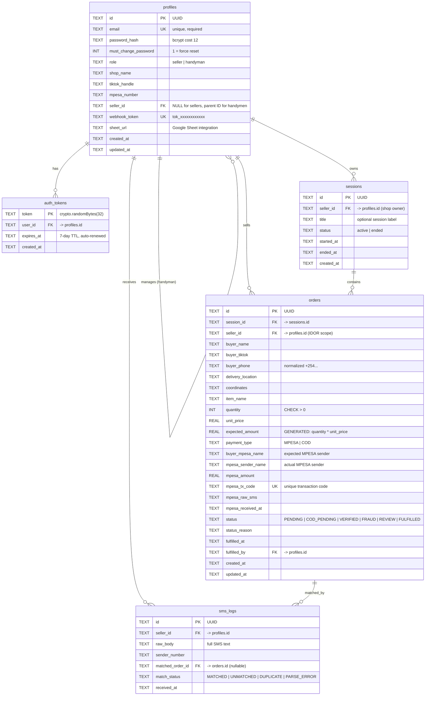

# LiveSoko: Database Schema 💾

Complete data dictionary for `livesoko.db` (SQLite, WAL Mode).

## Entity Relationship Diagram

## Indexes

| Index Name | Table | Column(s) | Purpose |
|---|---|---|---|
| `idx_orders_session_id` | orders | session_id | Fast order lookup per session |
| `idx_orders_seller_id` | orders | seller_id | IDOR scoping (every query uses this) |
| `idx_orders_status` | orders | status | Filter by payment status |
| `idx_orders_mpesa_tx` | orders | mpesa_tx_code | Duplicate TX detection |
| `idx_sessions_seller_status` | sessions | seller_id, status | Find active session instantly |
| `idx_sessions_created` | sessions | created_at | Session history sorting |
| `idx_sms_logs_seller_id` | sms_logs | seller_id | SMS audit trail per seller |
| `idx_profiles_seller_id` | profiles | seller_id | Handyman → Seller lookup |
| `idx_auth_tokens_user` | auth_tokens | user_id | Token cleanup per user |

## Multi-Tenant Isolation

Every query that reads or writes `orders`, `sessions`, or `sms_logs` includes `WHERE seller_id = ?` scoped to `req.user.shop_id`. This prevents cross-tenant data leakage even if a user guesses another user's resource ID.

## Migrations

Migrations run automatically on startup in `database.js`. They use safe patterns:
1. **Simple column additions**: `ALTER TABLE ... ADD COLUMN` (e.g., `buyer_mpesa_name`, `expires_at`).
2. **Constraint changes**: CREATE new → COPY data → DROP old → RENAME (e.g., adding `COD_PENDING` status).
3. **FK corruption repair**: `PRAGMA foreign_key_check()` → rebuild if corrupted.
